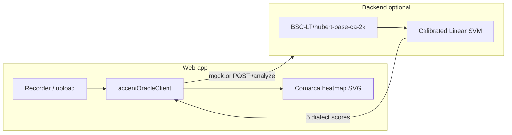

# Catalan Accent Oracle

**Quin és el meu accent en català?** — A research prototype that estimates which *macro dialect area* your Catalan speech sounds most similar to, inspired by [BoldVoice Accent Oracle](https://www.boldvoice.com/accent-oracle).

Record yourself reading a short Catalan passage (or upload audio), and the app shows a similarity heatmap across five dialect zones — not a claim about where you are from.

## What this is (and is not)

| This project does | This project does not |
| --- | --- |
| Compare your recording to five macro Catalan dialect areas | Pinpoint your town, comarca, or birthplace |
| Show calibrated similarity scores on a map of the Catalan-speaking territories | Replace linguistic expertise or self-identification |
| Offer a second recording when confidence is low (API mode) | Guarantee accuracy on short or noisy clips |

**Dialect zones:** `central`, `valencian`, `northwestern`, `northern`, `balearic`.

## Quick start — web demo

The fastest way to explore the product flow is the browser app with a **mock scorer** (no model download):

```bash
cd web
npm install
npm run dev
```

Open the URL Vite prints (usually `http://localhost:5173`). Record or upload audio, read the prompt aloud, and view the heatmap.

### With the real model (local API)

1. **Python environment** (from repo root):

   ```bash
   python -m venv .venv
   source .venv/bin/activate
   pip install -r requirements.txt
   ```

2. **Model artifact** — not in git. Train or copy `models/cv26-hubert-svm-calibrated/` (`model.joblib` + `metadata.json`). See [docs/ML_PIPELINE.md](docs/ML_PIPELINE.md).

3. **Start the API:**

   ```bash
   uvicorn backend.app:app --reload --host 127.0.0.1 --port 8000
   ```

   First `/analyze` request loads HuBERT on CPU and can take several seconds.

4. **Start the web app in API mode:**

   ```bash
   cd web
   VITE_ACCENT_ORACLE_MODE=api \
   VITE_ACCENT_ORACLE_API_URL=http://localhost:8000 \
   npm run dev
   ```

**API endpoints:** `GET /health`, `POST /analyze` (multipart field `audio`).

## How it works



1. User reads a fixed Catalan prompt ([`web/src/lib/prompts.ts`](web/src/lib/prompts.ts)).
2. Audio is sent to the mock client or the FastAPI backend ([`backend/app.py`](backend/app.py)).
3. The backend embeds audio with Catalan HuBERT (mean + std pooling), then runs a calibrated SVM.
4. Five dialect scores drive [`GeographicDialectHeatmap`](web/src/components/GeographicDialectHeatmap.tsx), which colors comarques on [`web/public/map-paisos-catalans.svg`](web/public/map-paisos-catalans.svg) via [`buildComarcaHeat.ts`](web/src/lib/buildComarcaHeat.ts).

In API mode, low-confidence or ambiguous top-two results trigger an optional **validation** pass with a shorter second prompt ([`needsValidation.ts`](web/src/lib/needsValidation.ts)).

## Current model (research snapshot)

| Metric | Held-out CV26 dev+test | External AINA benchmark |
| --- | ---: | ---: |
| Accuracy | ~50% | ~50% |
| Macro F1 | ~51% | ~50% |
| Top-2 accuracy | ~72% | ~70% |

Encoder: `BSC-LT/hubert-base-ca-2k`. Classifier: `StandardScaler` + `CalibratedClassifierCV(LinearSVC)`. Trained on 1,440 balanced CV26 clips (96 speakers × 3 clips × 5 dialects). Details: [`reports/model_artifact_cv26_hubert_svm_calibrated.md`](reports/model_artifact_cv26_hubert_svm_calibrated.md).

Suitable for a **local research prototype**, not a polished public release without more real-user testing and UX guardrails.

## Repository layout

```
proj-accents/
├── web/                 # Vite + React + TypeScript UI
├── backend/             # FastAPI inference API
├── scripts/             # Data prep, embeddings, training, audits
├── notebooks/           # Colab/Kaggle end-to-end pipeline
├── manifests/           # Speaker-balanced CSV manifests (no audio)
├── reports/             # Audits, baselines, evaluation write-ups
├── docs/                # Deeper documentation
├── data/                # Local only (gitignored): raw archives, audio
├── embeddings/          # Local only (gitignored)
└── models/              # Local only (gitignored): joblib artifacts
```

Large artifacts (`data/`, `embeddings/`, `models/`, `*.tar.gz`, `*.zip`) stay out of git. Regenerate from manifests and scripts.

## ML & dataset work

Training, audits, Colab bundles, and baseline commands live in **[docs/ML_PIPELINE.md](docs/ML_PIPELINE.md)**.

Highlights:

- Primary training data: Common Voice 26 Catalan (`train.tsv`, speaker-balanced).
- Hugging Face dataset loaders are unreliable for some AINA sets — prefer TSV metadata audits.
- Splits are **speaker-grouped** to avoid leakage.
- Cloud notebook: [`notebooks/cv26_accent_oracle_colab.ipynb`](notebooks/cv26_accent_oracle_colab.ipynb).

## Environment variables

Copy [`.env.example`](.env.example) to `.env` for Mozilla Data Collective downloads (~79 GB CV26 archive). Web app uses Vite env vars:

| Variable | Purpose |
| --- | --- |
| `VITE_ACCENT_ORACLE_MODE` | `api` or omit for mock |
| `VITE_ACCENT_ORACLE_API_URL` | Backend base URL (default `http://localhost:8000`) |

## Development checks

```bash
# Web
cd web && npm run lint && npm run build

# Python (from repo root, venv active)
python scripts/audit_aina_tsv_metadata.py --max-rows 200000
```

## For AI agents

See **[AGENTS.md](AGENTS.md)** and [`.cursor/rules/`](.cursor/rules/) for architecture notes, conventions, and safe edit boundaries.

## Status & next steps

- [x] Dataset metadata audits and balanced manifests
- [x] HuBERT + calibrated SVM baseline (~50% top-1, ~72% top-2)
- [x] Local FastAPI + web prototype with comarca heatmap
- [ ] More real-user recordings and threshold tuning
- [ ] Optional finer-grained `regionalHeatPoints` in API responses
- [ ] Public deployment polish
