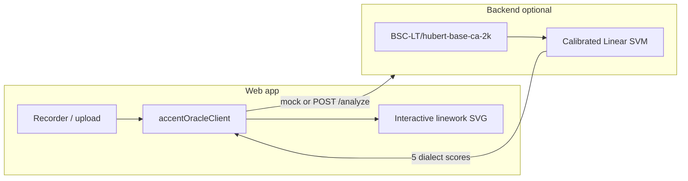

# Catalan Accent Oracle

[](https://huggingface.co/miquelt-9/cv26-hubert-svm-calibrated)
[](https://huggingface.co/BSC-LT/hubert-base-ca-2k)

**Quin és el meu accent en català?** — An open research prototype that estimates which *macro dialect area* your Catalan speech sounds most acoustically similar to, inspired by [BoldVoice Accent Oracle](https://www.boldvoice.com/accent-oracle) and powered by [BSC-LT's](https://huggingface.co/BSC-LT) Catalan speech foundation models (Projecte AINA).

Record yourself reading a short Catalan passage (or upload audio), and the app computes a calibrated similarity heatmap across five dialect zones (`central`, `valencian`, `northwestern`, `northern`, `balearic`) — not a claim about where you are from, but an acoustic proximity indicator.

https://github.com/user-attachments/assets/622d7309-2df2-4f1d-85de-f2d368378e4d

## Prerequisites

| Need | Mock UI | Local API |
| --- | --- | --- |
| Node.js 20+ (npm) | yes | yes |
| Python 3.11+ + venv | no | yes |
| System **ffmpeg** on `PATH` | no | yes — browser recordings are WebM; `librosa` needs ffmpeg to decode them |
| Disk / network | small | `pip install` pulls PyTorch + Transformers (multi‑GB); first analyze also caches HuBERT (`BSC-LT/hubert-base-ca-2k`) |

For local API development, CORS defaults to `http://localhost:5173` and
`http://127.0.0.1:5173` (HTTP and HTTPS). If Vite prints a different port,
free 5173 or open the app on 5173 so the browser origin matches. Production
origins are configured with `ORACLE_CORS_ORIGINS`; same-origin deployments do
not need an extra browser origin.

## Quick start — web demo

The fastest way to explore the product flow is the browser app with a **mock scorer** (no model download):

```bash
cd web
npm install
VITE_ACCENT_ORACLE_DEV=1 npm run dev
```

Open the URL Vite prints (usually `http://localhost:5173`). Record or upload audio, read the prompt aloud, and view the heatmap. With the dev flag you get the mock/API toggle and diagnostic UI (or use `?dev=1` instead).

### With the real model (local API)

1. **Python environment** (from repo root):

   ```bash
   python -m venv .venv
   source .venv/bin/activate
   pip install -r requirements.txt
   ```

2. **Model artifact** — **not in git** (`models/` is gitignored). After step 1, `hf` is available via `huggingface_hub`. Download the published classifier ([`miquelt-9/cv26-hubert-svm-calibrated`](https://huggingface.co/miquelt-9/cv26-hubert-svm-calibrated)):

   ```bash
   mkdir -p models/cv26-hubert-svm-calibrated
   hf download miquelt-9/cv26-hubert-svm-calibrated \
     --local-dir models/cv26-hubert-svm-calibrated
   ```

   That pulls `model.joblib` + `metadata.json` (~225 KB; Hub may also drop a model-card `README.md` in the same folder — fine to keep). Alternatively, train your own via [docs/ML_PIPELINE.md](docs/ML_PIPELINE.md).

   On first inference, Transformers downloads **HuBERT** (`BSC-LT/hubert-base-ca-2k`) into the local HF cache (~hundreds of MB). The first `POST /analyze` on CPU is slow (model load); later requests are faster.

3. **Start the API:**

   ```bash
   uvicorn backend.app:app --reload --host 127.0.0.1 --port 8000
   ```

   Sanity check: `curl -s http://127.0.0.1:8000/health` should show `"ok": true` once the classifier files are in place (encoder loads lazily on first `/analyze`).

4. **Start the web app in API mode:**

   ```bash
   cd web
   VITE_ACCENT_ORACLE_MODE=api \
   VITE_ACCENT_ORACLE_API_URL=http://localhost:8000 \
   VITE_ACCENT_ORACLE_DEV=1 \
   npm run dev
   ```

   Dev server uses HTTPS (self-signed) so mic works on localhost. For a phone on the same Wi‑Fi:

   ```bash
   VITE_ACCENT_ORACLE_MODE=api \
   VITE_ACCENT_ORACLE_API_URL= \
   VITE_ACCENT_ORACLE_DEV=1 \
   npm run dev:lan
   ```

   Open the printed `https://<lan-ip>:5173/` URL and accept the certificate warning. Empty `VITE_ACCENT_ORACLE_API_URL` makes the app call the Vite proxy (same origin → backend on `:8000`).

**API endpoints:**

| Method | Path | Purpose |
| --- | --- | --- |
| `GET` | `/health` | Legacy model health / Better Stack compatibility |
| `POST` | `/analyze` | Multipart `audio` (+ `promptId` / `promptText` / CV26 `sentenceIds` and optional `analysisSessionId`) → dialect scores + session/take IDs (pending audio until research consent) |
| `POST` | `/analysis-finalize` | JSON `{ analysisSessionId, finalResult, takeCount, terminalState }` → persists the displayed merged result while pending |
| `POST` | `/research-consent` | JSON `{ analysisSessionId, consent, ageConfirmed?, policyVersion? }` → keep or delete every take in the session |
| `POST` | `/feedback` | JSON `{ feedbackId?, analysisSessionId, recordingId?, wasCorrect?, comarca?, selfReportedDialect?, notes? }` → one session-level feedback row |

No IP address or User-Agent is stored: the caller IP only feeds the in-memory rate limiters, and the self-declared `comarca` is the geographic signal.

Successful `/analyze` calls create a **pending** analysis session and one pending take under gitignored `data/user_submissions/` (SQLite + audio). Every validation/refinement take shares the same session ID and is retained for research only when the user opts in on the results screen (`POST /research-consent`). Pending sessions expire after ~30 minutes (`ORACLE_PENDING_CONSENT_TTL_SECONDS`). Deletion of consented sessions is **manual** (email the configured contact in the UI → `python scripts/soft_delete_submission.py <session-or-recording-uuid>`); there is no automated deletion API in v1. Future training must use only `research_consent=1` rows from non-deleted sessions/takes.

Backend load guards (env overrides): `ORACLE_WORKERS` (fixed at startup; default is `1` for 1–2 logical CPUs, `2` for 3–4, `4` for 5–8, and `min(cpu_count // 2, 8)` above that), `ORACLE_MAX_QUEUE_SIZE` (default `20` waiting jobs), `ORACLE_ENCODE_RETRY_AFTER` (default `5`), `ORACLE_ANALYZE_RATE_LIMIT` / `ORACLE_ANALYZE_RATE_WINDOW` (default `10` / `60`s), `ORACLE_FEEDBACK_RATE_LIMIT` / `ORACLE_FEEDBACK_RATE_WINDOW` (default `30` / `60`s), `ORACLE_MAX_AUDIO_SECONDS` (default `25`), `ORACLE_PENDING_CONSENT_TTL_SECONDS` (default `1800`), and `ORACLE_TRUST_PROXY` (default off). `ORACLE_ENCODE_CONCURRENCY` remains a deprecated compatibility fallback when `ORACLE_WORKERS` is unset. The queue is process-local and bounded; requests beyond worker capacity plus the waiting queue receive HTTP `503` rather than waiting without limit.

## How it works


```mermaid
flowchart LR
  subgraph web [Web app]
    Rec[Recorder / upload]
    Map[Interactive linework SVG]
    Rec --> Client[accentOracleClient]
    Client --> Map
  end

  subgraph api [Backend optional]
    HuBERT[BSC-LT/hubert-base-ca-2k]
    SVM[Calibrated Linear SVM]
    HuBERT --> SVM
  end

  Client -->|mock or POST /analyze| api
  SVM -->|5 dialect scores| Client
```

1. User reads a 15–20 second Catalan passage from the curated CV26 pool ([`web/src/lib/readAloudPrompts.generated.ts`](web/src/lib/readAloudPrompts.generated.ts)), selected through [`web/src/lib/prompts.ts`](web/src/lib/prompts.ts).
2. Audio is sent to the mock client or the FastAPI backend ([`backend/app.py`](backend/app.py)), with the prompt id/text and original CV26 sentence IDs for storage.
3. The backend embeds audio with Catalan HuBERT (mean + std pooling), then runs a calibrated SVM.
4. Five dialect scores drive [`ResultsMapStage`](web/src/components/ResultsMapStage.tsx) — ranking sidebar plus interactive linework map that highlights the whole selected macro-dialect region ([`map-oracle-linework.svg`](web/public/map-oracle-linework.svg)).

When the first result is uncertain (top score &lt; 0.50 or top-two gap &lt; 0.15), or the top pair is geographically incoherent with a material runner-up, a **mandatory second take** is required before results; validation and refinement average every raw take score vector equally. Mean pairwise score disagreement above `0.18` keeps the aggregate uncertain and prevents a strong evidence band. If the aggregate result is still uncertain, an **optional third** take is offered. If uncertainty remains after three takes, the results view shows the full distribution and de-emphasizes the top-match card while keeping the clearly labelled illustrative comarca pin ([`needsValidation.ts`](web/src/lib/needsValidation.ts)).

## Current model (research snapshot)

| Metric | Held-out CV26 dev+test | External AINA benchmark |
| --- | ---: | ---: |
| Accuracy | ~50% | ~50% |
| Macro F1 | ~51% | ~50% |
| Top-2 accuracy | ~72% | ~70% |

Encoder: `BSC-LT/hubert-base-ca-2k` (**Apache-2.0**, © 2025 BSC Language Technologies Unit — see [`NOTICE`](NOTICE)). Classifier: `StandardScaler` + `CalibratedClassifierCV(LinearSVC)` — published at [`miquelt-9/cv26-hubert-svm-calibrated`](https://huggingface.co/miquelt-9/cv26-hubert-svm-calibrated) (MIT for the sklearn artifact only; does not redistribute HuBERT weights). Trained on 1,440 balanced CV26 clips (96 speakers × 3 clips × 5 dialects). Details: [`reports/model_artifact_cv26_hubert_svm_calibrated.md`](reports/model_artifact_cv26_hubert_svm_calibrated.md).

**Speaker scarcity:** the balanced set is capped by the **northern** dialect (~96 usable speakers after benchmark holdout), while central has thousands. Consenting user recordings plus self-reported dialect labels (via post-result feedback) are the main path to more speaker diversity beyond CV26.

Suitable for a **local research prototype**, not a polished public release without more real-user testing and UX guardrails.

## Repository layout

```
proj-accents/
├── web/                 # Vite + React + TypeScript UI
├── backend/             # FastAPI inference API
├── scripts/             # Data prep, embeddings, training, audits
├── notebooks/           # Colab/Kaggle end-to-end pipeline
├── manifests/           # Speaker-balanced CSV manifests (no audio)
├── reports/             # Audits, baselines, evaluation write-ups
├── docs/                # Deeper documentation
├── data/                # Local only (gitignored): raw archives, audio
│   └── user_submissions/  # API mode: SQLite + stored audio/feedback
├── embeddings/          # Local only (gitignored)
└── models/              # Local only (gitignored): joblib artifacts
```

Large artifacts (`data/`, `embeddings/`, `models/`, `*.tar.gz`, `*.zip`) stay out of git. The inference classifier is published on Hugging Face (see Quick start); training data/embeddings are regenerated from manifests and scripts.

## ML & dataset work

Training, audits, Colab bundles, and baseline commands live in **[docs/ML_PIPELINE.md](docs/ML_PIPELINE.md)**.

Highlights:

- Primary training data: Common Voice 26 Catalan (`train.tsv`, speaker-balanced).
- Hugging Face dataset loaders are unreliable for some AINA sets — prefer TSV metadata audits.
- Splits are **speaker-grouped** to avoid leakage.
- Cloud notebook: [`notebooks/cv26_accent_oracle_colab.ipynb`](notebooks/cv26_accent_oracle_colab.ipynb).

## Environment variables

Copy [`.env.example`](.env.example) to `.env` for Mozilla Data Collective downloads (~79 GB CV26 archive). Web app uses Vite env vars:

| Variable | Purpose |
| --- | --- |
| `VITE_ACCENT_ORACLE_MODE` | `api` or omit for mock |
| `VITE_ACCENT_ORACLE_API_URL` | Backend base URL (default `http://localhost:8000`) |
| `VITE_ACCENT_ORACLE_DEV` | `1` to show diagnostic UI (CPU hint, validation internals) + Mode cycle (**API → mock fail → mock success**). Also `?dev=1` (persists in `localStorage`; `?dev=0` clears). |
| `VITE_PUBLIC_SITE_URL` | Optional promo URL on the results share card (defaults to `window.location.host`). Native image share needs HTTPS (`isSecureContext`); on plain HTTP LAN, the UI downloads the PNG instead. |
| `VITE_SENTRY_DSN` | Frontend Sentry DSN (omit to disable) |
| `VITE_SENTRY_ENVIRONMENT` | Sentry environment (default `development`; Sentry stays off in development unless `VITE_SENTRY_ENABLE_DEV=1`) |
| `VITE_SENTRY_RELEASE` | Release string tagged on events |
| `VITE_SENTRY_ENABLE_DEV` | `1` to allow Sentry in development when DSN is set |

Backend observability (set in the shell / process env for uvicorn — see [`.env.example`](.env.example)):

| Variable | Purpose |
| --- | --- |
| `SENTRY_DSN` | Backend Sentry DSN (omit to disable) |
| `SENTRY_ENVIRONMENT` | Sentry environment (default `development`; off in development unless `SENTRY_ENABLE_DEV=1`) |
| `SENTRY_RELEASE` / `ORACLE_APP_VERSION` / `ORACLE_GIT_SHA` | Release string (`SENTRY_RELEASE` wins; otherwise the API combines version + short SHA) |
| `SENTRY_ENABLE_DEV` | `1` to allow Sentry + `/sentry-debug` outside production |
| `GRAFANA_OTLP_ENDPOINT` | Grafana Cloud OTLP base URL (e.g. `https://otlp-gateway-…/otlp`) |
| `GRAFANA_OTLP_API_KEY` | Grafana Cloud OTLP Basic auth token |

Never commit real DSNs or API keys.

## Observability

Lightweight production monitoring with a hard privacy boundary: **no audio, request bodies, transcripts, comarca, recording IDs, consent payloads, or filenames** are sent to any vendor.

### Sentry (application errors)

**Purpose:** frontend and backend exceptions, Python logs (via LoggingIntegration), and sampled request performance traces (`traces_sample_rate=0.10`). Session Replay is **error-only** on the web (`replaysSessionSampleRate=0`, `replaysOnErrorSampleRate=1`, text masked / media blocked).

**Collected:** stack traces, release/environment tags, low-cardinality tags (`app`, `service` / `api_mode`, optional `prompt_id` id only), HTTP route/status metadata after scrubbing.

**Not collected:** uploaded audio, multipart bodies, `promptText`, comarca, recording IDs, consent responses, filenames, user identity (`send_default_pii=False` + `before_send` scrubbers).

**Local enable:** set DSN + `SENTRY_ENABLE_DEV=1` / `VITE_SENTRY_ENABLE_DEV=1`. Dev-only `GET /sentry-debug` raises intentionally (404 in production).

**Verify:**

1. Backend: `SENTRY_DSN=… SENTRY_ENABLE_DEV=1 uvicorn …` then `curl -i http://127.0.0.1:8000/sentry-debug` → event in Sentry.
2. Frontend: `VITE_SENTRY_DSN=… VITE_SENTRY_ENABLE_DEV=1 npm run dev` → trigger an error (or temporary `throw`) → event + optional error replay.
3. Grafana: set `GRAFANA_OTLP_*`, hit `/health` and `/telemetry/event`, then Explore `accent_oracle_*` on `grafanacloud-prom`.
4. Better Stack: deferred until a public URL exists; use the
   [production checklist](docs/PRODUCTION_CHECKLIST.md) before enabling it.

Deferred follow-ups for agents: [`ops/followups/`](ops/followups/) (Grafana email routing, Better Stack monitors, Sentry releases/source maps, container metrics).

### Grafana Cloud (operational metrics)

**Purpose:** request rate/latency, inference duration, inference queue depth, active workers, queue wait time, rejected inference jobs, analyze/consent/feedback counters, allowlisted UI product events (`page_load`, `homepage_viewed`, `recording_started`, `recording_press_hold`, `recording_too_short`, `recording_no_speech`, `recording_completed`, `analyze_pressed`, `analysis_completed`, `validation_started`, `third_take_offered`, `third_take_completed`, `third_take_skipped`, `analysis_finalized`, `analysis_unresolved`, `share_clicked`, `research_consent_accepted` via `POST /telemetry/event`), plus process CPU/memory when OTLP is configured. Analyze logs include queue depth, active workers, queue wait, inference duration, and total request duration. Traces stay in Sentry — OTLP is metrics-only.

**Dashboard:** [Accent Oracle — Operations](https://bigdahlia593.grafana.net/d/accent-oracle-operations) (also [`ops/grafana/accent-oracle-operations.json`](ops/grafana/accent-oracle-operations.json)).

**Alerts (no paging integrations wired in-repo):** backend error-rate spike; inference latency spike; application unavailable (missing process metrics).

### Better Stack (uptime) — before public release

Not configured yet (no public URL). Before production:

1. Create monitors for the public **homepage** and **`{API}/health`**.
2. Interval **60 seconds**, **SSL verification on**, keep response-time history.
3. **Email notifications only** — no SMS, voice, push, or incident paging for v1.

## Production Deployment

The recommended topology is a same-origin reverse proxy: Caddy or nginx
terminates HTTPS, serves `web/dist`, and proxies API paths to uvicorn. Keep
`VITE_ACCENT_ORACLE_API_URL` empty in this deployment so the browser calls the
same origin. HTTPS is required for microphone access and native Web Share;
the SPA proxy must allow `microphone=(self)` while the API's security policy
can remain restrictive. The in-process rate limiter is not shared across
uvicorn workers or hosts, so production must use one API process/host without
replicas or deploy and verify a separate shared limiter.

Set the production build and runtime values in
[`web/.env.example`](web/.env.example) and [`.env.example`](.env.example):
`VITE_PRIVACY_EMAIL`, `VITE_CONTROLLER_NAME`, `VITE_POSTHOG_KEY` /
`VITE_POSTHOG_HOST=https://eu.i.posthog.com`, frontend/backend Sentry
settings, Grafana OTLP credentials, release metadata, exact
`ORACLE_CORS_ORIGINS` when cross-origin access is needed, and
`ORACLE_TRUST_PROXY=1` only behind a trusted proxy. Never commit their
secrets. Use [`ops/caddy/Caddyfile.example`](ops/caddy/Caddyfile.example) as
the reverse-proxy starting point.

Before public traffic, follow
[`docs/PRODUCTION_CHECKLIST.md`](docs/PRODUCTION_CHECKLIST.md) and read
[`docs/PRODUCTION_READINESS.md`](docs/PRODUCTION_READINESS.md). Back up
SQLite and audio using [`docs/BACKUP.md`](docs/BACKUP.md), and review the
privacy evidence and launch checks in
[`docs/PRIVACY_AUDIT.md`](docs/PRIVACY_AUDIT.md). Observability details and
deferred provider setup remain in the [Observability](#observability) section
and [`ops/followups/`](ops/followups/).

### Inference load benchmark

Run the local API with a chosen `ORACLE_WORKERS` value and compare the default
concurrency sweep (`1,2,4,8,16`):

```bash
python scripts/benchmark_inference_load.py \
  --base-url http://127.0.0.1:8000 \
  --audio /path/to/sample.wav \
  --requests 16
```

The script reports p50/p95 latency, throughput, HTTP status counts, and
system CPU utilization. Repeat with different worker counts for each VPS size;
the benchmark intentionally exercises the real `/analyze` endpoint.

### Repeated-take evaluation

Use speaker-grouped repeated-take JSONL to compare first-take, fixed
two/three-take, and adaptive validation policies:

```bash
python scripts/evaluate_validation_policy.py \
  --input data/validation_policy/speaker_grouped.jsonl \
  --output reports/validation_policy_evaluation.json
```

See [`reports/validation_policy_evaluation.md`](reports/validation_policy_evaluation.md)
for the input contract and metrics. Do not split takes from one speaker across
train and evaluation partitions.

## Development checks
Before substantive web/backend PRs, run the same lightweight checks CI will enforce (no model download, no HuBERT, no ffmpeg):

```bash
# Web — lint, production build, unit tests
cd web && npm run lint && npm run build && npm test

# Python — unit tests (from repo root; use requirements-dev.txt, not full torch stack)
pytest -q
```

GitHub Actions (`.github/workflows/ci.yml`) runs these on pull requests and pushes to `main`. Optional ML audits (e.g. `python scripts/audit_aina_tsv_metadata.py --max-rows 200000`) stay local.

## Collaborating

See **[CONTRIBUTING.md](CONTRIBUTING.md)** for a short contributor checklist. Summary:

| Path | What you need |
| --- | --- |
| **Mock-first** | `cd web && npm install && VITE_ACCENT_ORACLE_DEV=1 npm run dev` — no backend or model |
| **API mode** | Python venv + `hf download miquelt-9/cv26-hubert-svm-calibrated --local-dir models/cv26-hubert-svm-calibrated` + uvicorn + `VITE_ACCENT_ORACLE_MODE=api` + `VITE_ACCENT_ORACLE_DEV=1` |
| **Dev UI** | Included via `VITE_ACCENT_ORACLE_DEV=1` above, or `?dev=1` in the browser (persists in `localStorage`; `?dev=0` clears) |

## License

- **This repository** (app code, scripts, docs): [AGPL-3.0](LICENSE). Keep it — Apache-2.0 on the upstream encoder does **not** require changing the project license.
- **Inference classifier** on the Hub (`miquelt-9/cv26-hubert-svm-calibrated`, sklearn `joblib` only): MIT (see that model card).
- **Speech encoder** [`BSC-LT/hubert-base-ca-2k`](https://huggingface.co/BSC-LT/hubert-base-ca-2k): **Apache-2.0**, © 2025 Language Technologies Unit, Barcelona Supercomputing Center. Attribution and notices: **[NOTICE](NOTICE)**. The encoder is downloaded at runtime; this repo does not vendor or redistribute its weights.

Architecture and safe edit boundaries for humans and AI agents: **[AGENTS.md](AGENTS.md)** and [`.cursor/rules/`](.cursor/rules/).

## Status & next steps

**Done (research prototype):**

- [x] Dataset metadata audits and balanced manifests
- [x] HuBERT + calibrated SVM baseline (~50% top-1, ~72% top-2)
- [x] Local FastAPI + web prototype with interactive linework map
- [x] Post-result research opt-in + feedback + Manage My Data (ledger lists consented analysis-session IDs; all session takes remain under `data/user_submissions/`)

**Known limitations / not production-ready:**

- [ ] Set `VITE_PRIVACY_EMAIL` + `VITE_CONTROLLER_NAME` before public launch (see [`web/.env.example`](web/.env.example)); deletion is email → manual soft-delete by ID (no self-serve API)
- [ ] Map community snap is **visual placement**, not true geographic topology
- [ ] User submissions are **not** auto-ingested into training (filter `research_consent=1` when you do)
- [ ] Grow speaker diversity via consented recordings + self-labels (northern bottleneck)
- [ ] More real-user recordings and threshold tuning
- [ ] Optional finer-grained `regionalHeatPoints` in API responses
- [ ] Public deployment polish (hosting, model size, WASM vs server inference)

### Public release checklist (Spain research)

Use the repeatable
[`docs/PRODUCTION_CHECKLIST.md`](docs/PRODUCTION_CHECKLIST.md) for deployment
evidence; this is the short project-specific summary:

1. Configure privacy identity: `VITE_PRIVACY_EMAIL`, `VITE_CONTROLLER_NAME` → rebuild web.
2. Confirm server + storage in Spain / EEE; `ORACLE_TRUST_PROXY=1` behind a reverse proxy.
3. Verify pending → decline/TTL deletes audio; opt-in sets `research_consent=1`.
4. Soft-delete a test UUID and confirm scrub + audio removal.
5. Install and evidence pending/research-retention purge schedules, encrypted
   backups, an isolated restore drill, and deletion-aware backup expiry.
6. Add production CORS origins for the public site; set `SENTRY_*` /
   `VITE_SENTRY_*` / `GRAFANA_OTLP_*` for the deploy environment. Assign
   monitoring/incident ownership and test notification delivery.
7. Record provider retention/access reviews, the deployed `/version`, commit
   and model artifact evidence, and the rollback target.
8. Better Stack: create homepage + `/health` monitors (60s, SSL on, email only
   — see the [production checklist](docs/PRODUCTION_CHECKLIST.md)).
9. Optional lawyer check before viral traffic; legal/privacy sign-off remains
   a launch gate.
